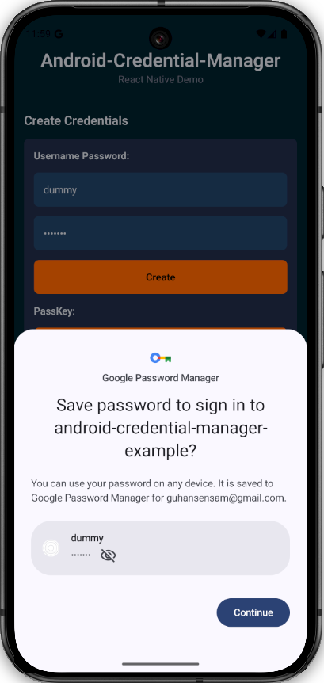

# Saving Username and Passwords

<figure><figcaption>
Saving an username and password
</figcaption></figure>

This is the simplest form of credential that is available. After you have completed your sign in process you can prompt your user to save their username and password. Credential Manager will automatically surface a bottom card that will allow the user to save the credential to their Google Credential manager. This means this credential is now available across all devices that the user has their Google Account logged into.

## Code :

To prompt the user to save an username and password credential use the following code

<pre class="language-typescript"><code class="lang-typescript">import { CredentialManager } from "credential-manager/CredentialManager";

<strong>CredentialManager.saveUsernameAndPassword(username, password);
</strong></code></pre>

